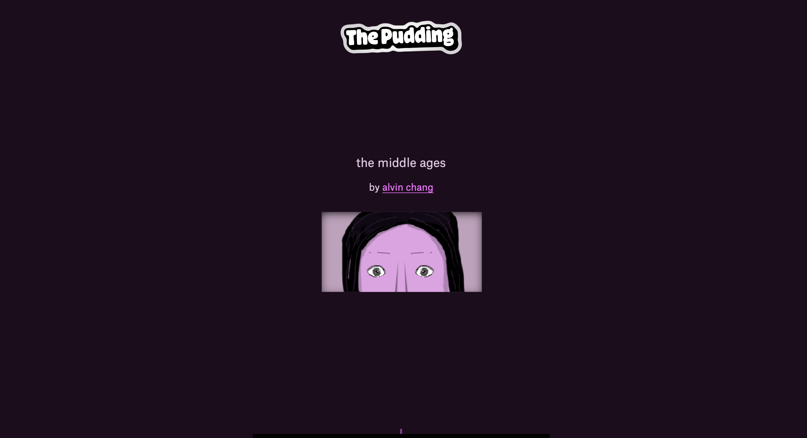
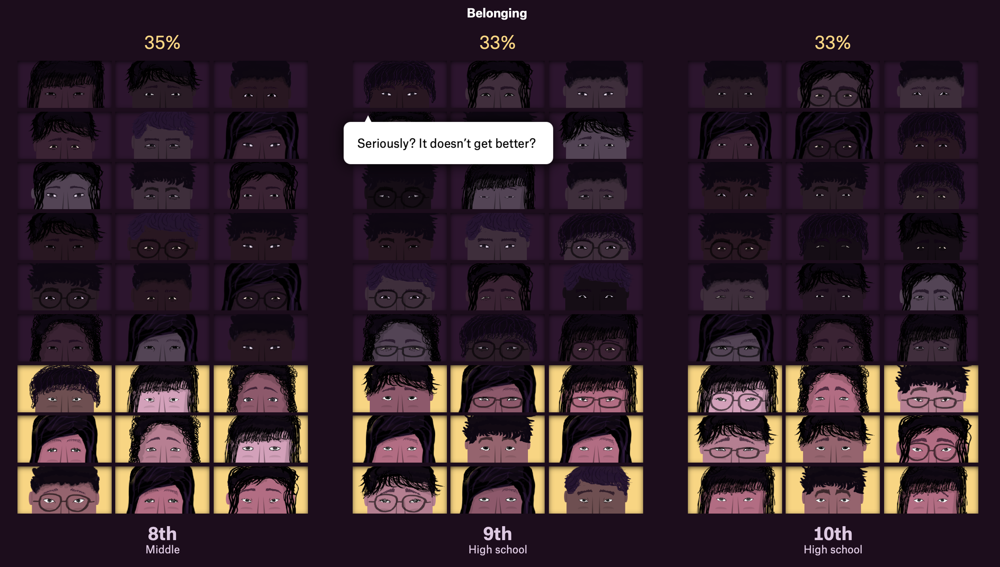

# Tarea 01 - 
## Paloma Campos - paloma.campos@uc.cl

The middle age: 
https://pudding.cool/2025/02/middle-school/

The middle age es una webstory que investiga las diferentes emociones de estudiantes de primaria que están en etapas transitorias hacia la adolescencia. Especificamente, enfocado en niños de 4th, 5th, 6th, 7th, 8th, 9th, 10th, 11th y 12th grade. 

Dentro de la lectura, se entiende que existe un entrevistador que va a preguntando a los distintos niveles de curso cómo se sienten. Comienzan con el nivel más pequeño 4th y continúa comparandolo con 5th, 6th y sucesivamente. La encuesta muestra a 27 personajes, que representan distintas etnias y edades. Este recurso le da al lector la sensación de estar frente a un grupo real de estudiantes, aunque en realidad se trata de una síntesis de los más de 40 millones de respuestas recolectadas en encuestas. Lo que podría ser una fría acumulación de cifras se transforma así en una conversación cálida y directa.

La forma en representar las distintas cifras a través de una entrevista funciona y hace divertido leerlo. Cuando comencé a leer el webstory me quedé enganchada en la conversación que tenía la "voz" con los niños; siempre con un lenguaje cercano y fácil de entender. Como si realmente quisiera profundizar en las penas que sienten aquellos niños a medida que avanzan de grado. 

El proyecto también aporta un contexto histórico interesante. Hace más de un siglo, cuando se creó el modelo de middle school en Estados Unidos, la intención era preparar mejor a los niños para la secundaria. Sin embargo, la evidencia que recopila The Pudding muestra que este sistema, lejos de facilitar, genera un quiebre emocional y académico. Incluso se compara con los colegios K-8 (donde los niños permanecen más tiempo en el mismo espacio escolar), que parecen generar mejores resultados en términos de bienestar y autoconfianza.

Más allá de lo bonito que se ve, lo que cuenta esta investigación es bastante fuerte. Cuando los niños pasan de primaria a middle school —justo entre los 11 y 14 años— empiezan a sentir menos pertenencia, menos confianza con los profes y menos ganas de estar en la escuela. Todo esto ocurre justo en una etapa en que el cerebro cambia un montón y se vuelve más sensible al entorno. O sea, en el momento en que más necesitan apoyo y compañía, es cuando más se sienten solos.

En conclusión, The Middle Ages no solo es un proyecto visualmente atractivo y entretenido de leer, sino también un aporte importante para repensar cómo tratamos a los adolescentes en una etapa tan delicada de sus vidas. Logra el equilibrio perfecto entre datos, narrativa y emoción, invitándonos a mirar con otros ojos un período que muchas veces queda olvidado en la conversación educativa.

